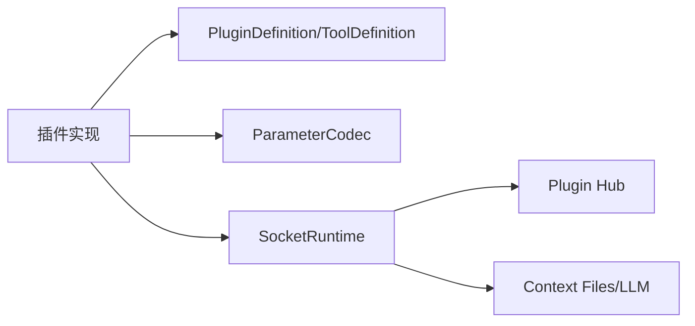

# atomemo-plugin-sdk-ex - 系统概览

## 1. 系统定位
`atomemo-plugin-sdk-ex` 是 Atomemo 插件生态的 Elixir SDK，负责插件定义建模、参数编解码、运行时通信与上下文能力。

扫描数据：
- Elixir 文件约 108 个
- 无 Phoenix Router/Repo migration
- 大量 `Ecto.Schema` 用于“配置模型与参数模型”而非数据库

## 2. 责任边界
- 负责：插件定义结构、参数校验与转换、Socket Runtime 与 Hub 协议交互。
- 不负责：具体业务插件逻辑与业务存储。

## 3. 总览架构图

