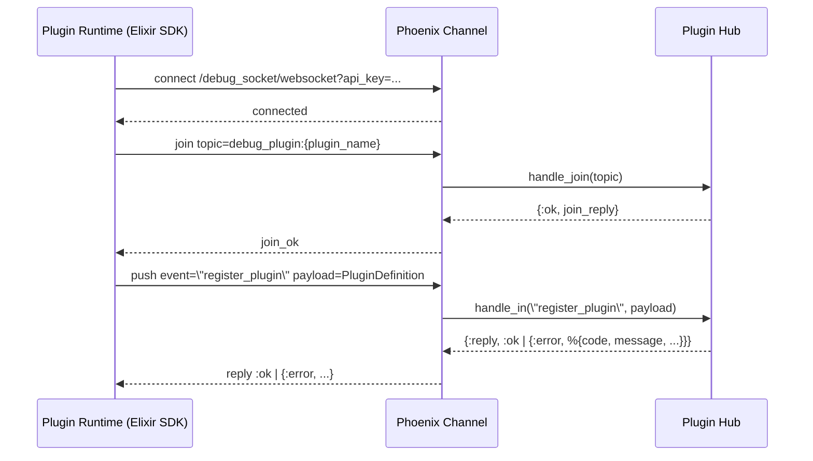
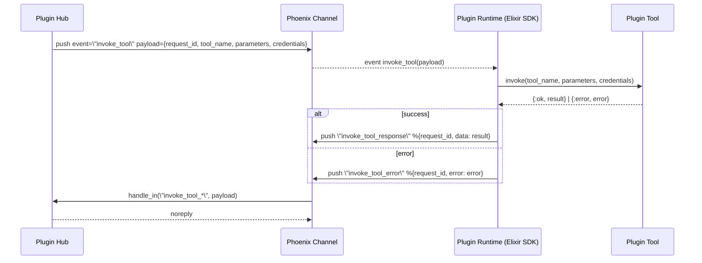
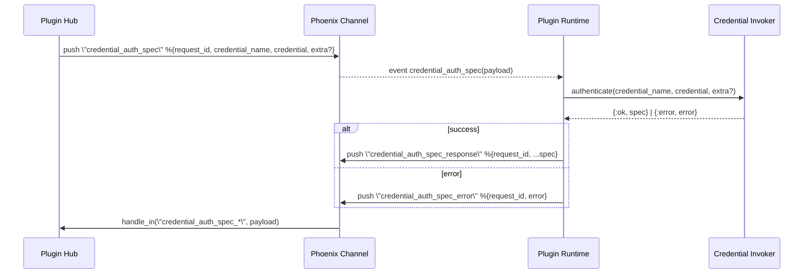
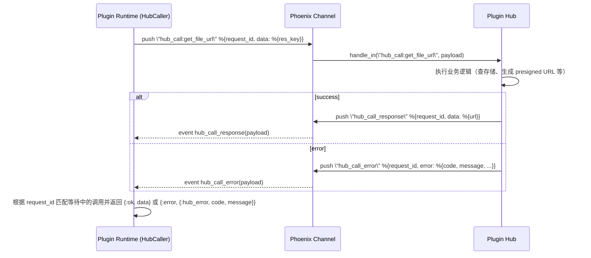

# Plugin Hub – SDK WebSocket 协议

本文档描述 Plugin Hub 与插件运行时（Elixir / JS SDK）之间的 WebSocket 事件与 payload 结构，供各端实现参考。  
重点按「业务流程」而不是「方向（Hub ↔ Plugin）」来组织：register plugin、invoke tool、credential auth spec、hub call 等。

---

## 连接与 Topic

### Debug 模式

- **URL**: `ws://{host}/debug_socket/websocket?api_key={api_key}`
- **Topic**: `debug_plugin:{plugin_name}`
- **认证**: 通过 query 参数 `api_key` 校验

### Release 模式

- **URL**: `ws://{host}/release_socket/websocket`
- **Topic**: `release_plugin:{name}__release__{version}`  
  与 Hub 的 `version_slug` 一致（例如 `my_plugin__release__1.0.0`）

---

## Register plugin（仅 debug 模式）

### 流程说明

- 插件运行时连接 `debug_socket`，加入 `debug_plugin:{plugin_name}`。
- 加入成功后，插件通过 `register_plugin` 事件把 `PluginDefinition` 发送给 Hub。
- Hub 校验 definition，成功或失败都通过 reply 返回。

### 时序图（mermaid）



### 事件与 Payload

- **Channel event**: `register_plugin`
- **Payload**: `PluginDefinition` 的 JSON（含 `name`, `version`, `tools`, `credentials`, `models` 等）
- **Reply（Phoenix reply）**:
  - 成功: `:ok` 或 `{:ok, %{success: true}}`
  - 失败: `{:error, %{code: string, message: string, suberrors?: any}}`

### Phoenix JS 示例：连接并注册插件

```javascript
import { Socket } from "phoenix";

const apiKey = "DEBUG_API_KEY";
const pluginName = "my_plugin";

const socket = new Socket("ws://localhost:4000/debug_socket/websocket", {
  params: { api_key: apiKey },
});

socket.connect();

const channel = socket.channel(`debug_plugin:${pluginName}`);

channel
  .join()
  .receive("ok", () => {
    const pluginDefinition = {
      name: pluginName,
      version: "1.0.0",
      // tools, credentials, models ...
    };

    channel
      .push("register_plugin", pluginDefinition)
      .receive("ok", (resp) => {
        console.log("register_plugin ok", resp);
      })
      .receive("error", (err) => {
        console.error("register_plugin error", err);
      });
  })
  .receive("error", (err) => {
    console.error("join error", err);
  });
```

---

## Invoke tool 流程

### 流程说明

- Hub 向插件发送 `invoke_tool` 事件，请求执行某个工具。
- 插件运行时调用相应的 tool，实现完成后：
  - 成功时通过 `invoke_tool_response` 发送结果；
  - 失败时通过 `invoke_tool_error` 发送错误。

### 时序图（mermaid）



### 事件与 Payload

#### Hub → Plugin：`invoke_tool`

- **event**: `invoke_tool`
- **payload**:
  - `request_id`: string
  - `plugin_identifier`: string（debug 为 plugin name，release 为 version_slug）
  - `tool_name`: string
  - `parameters`: map，键为参数名，值见下方「parameters 中的值类型」
  - `credentials`: map，键为 credential instance id，值为解密后的凭证参数 map

#### Plugin → Hub：`invoke_tool_response`

- **event**: `invoke_tool_response`
- **payload**: `%{ "request_id" => string, "data" => any }`
- **reply**: 无（noreply）

#### Plugin → Hub：`invoke_tool_error`

- **event**: `invoke_tool_error`
- **payload**: `%{ "request_id" => string, "error" => any }`
- **reply**: 无（noreply）

### Phoenix JS 示例：处理 invoke_tool

```javascript
// 假设已经有 channel（见上文 register_plugin 示例）

channel.on("invoke_tool", async (payload) => {
  const { request_id, tool_name, parameters } = payload;

  try {
    // 这里直接模拟一个 tool 调用
    let result;

    if (tool_name === "echo") {
      result = { echo: parameters };
    } else {
      throw new Error(`unknown tool: ${tool_name}`);
    }

    channel.push("invoke_tool_response", {
      request_id,
      data: result,
    });
  } catch (e) {
    channel.push("invoke_tool_error", {
      request_id,
      error: { message: e.message },
    });
  }
});
```

---

## Credential auth spec 流程

### 流程说明

- Hub 请求插件为某个 credential 生成 auth spec。
- 插件运行时调用 credential invoker：
  - 成功时发送 `credential_auth_spec_response`；
  - 失败时发送 `credential_auth_spec_error`。

### 时序图（mermaid）



### 事件与 Payload

#### Hub → Plugin：`credential_auth_spec`

- **event**: `credential_auth_spec`
- **payload**:
  - `request_id`: string
  - `credential_name`: string
  - `credential`: map（解密后的凭证参数）
  - `extra`: map（可选扩展）

#### Plugin → Hub：`credential_auth_spec_response`

- **event**: `credential_auth_spec_response`
- **payload**: `%{ "request_id" => string, ...auth_spec }`
- **reply**: 无（noreply）

#### Plugin → Hub：`credential_auth_spec_error`

- **event**: `credential_auth_spec_error`
- **payload**: `%{ "request_id" => string, "error" => any }`
- **reply**: 无（noreply）

---

## Hub call 流程（插件主动调用 Hub 能力）

Hub call 是从 **插件运行时 → Hub** 的「RPC 风格」调用，比如获取文件 URL（`get_file_url`）等。  
协议采用统一的 `hub_call:{event}` + `hub_call_response` / `hub_call_error` 事件。

### 流程说明（以 `get_file_url` 为例）

- 插件运行时生成一个唯一的 `request_id`。
- 通过 `hub_call:get_file_url` 事件把 `{request_id, data}` 发送给 Hub：
  - `data` 中包含具体参数，比如 `%{"res_key" => "path/to/file.pdf"}`。
- Hub 异步处理，完成后通过：
  - 成功：`hub_call_response`，payload `%{ "request_id" => string, "data" => any }`
  - 失败：`hub_call_error`，payload `%{ "request_id" => string, "error" => %{ "code" => string, "message" => string, ... } }`

### 时序图（mermaid）



### 事件与 Payload

#### Plugin → Hub：`hub_call:{event}`

- **event**: 例如 `hub_call:get_file_url`、`hub_call:demo_hub_call` 等。
- **payload**:
  - `request_id`: string（调用唯一标识，由 SDK 生成，例如 UUID）
  - `data`: map（具体事件的参数）

#### Hub → Plugin：`hub_call_response`

- **event**: `hub_call_response`
- **payload**:
  - `request_id`: string
  - `data`: any（业务返回值）

#### Hub → Plugin：`hub_call_error`

- **event**: `hub_call_error`
- **payload**:
  - `request_id`: string
  - `error`: map
    - `code`: string（错误码）
    - `message`: string（人类可读错误信息）
    - 其他字段可选，用于携带更多上下文

### Phoenix JS 示例：作为 SDK 客户端发起一次 hub_call:get_file_url

```javascript
// 这个示例站在「SDK 客户端」视角，使用 Phoenix JS
// 向 Hub 发送 hub_call:get_file_url，并等待 hub_call_response / hub_call_error。

import { Socket } from "phoenix";
import { v4 as uuidv4 } from "uuid";

const apiKey = "DEBUG_API_KEY";
const pluginName = "hub_caller_test_plugin";

const socket = new Socket("ws://localhost:4000/debug_socket/websocket", {
  params: { api_key: apiKey },
});

socket.connect();

const channel = socket.channel(`debug_plugin:${pluginName}`);

channel
  .join()
  .receive("ok", () => {
    console.log("joined debug_plugin channel");
  })
  .receive("error", (err) => {
    console.error("join error", err);
  });

function hubCallGetFileUrl(resKey) {
  return new Promise((resolve, reject) => {
    const requestId = uuidv4();

    const onResponse = (payload) => {
      if (payload.request_id !== requestId) return;

      channel.off("hub_call_response", onResponse);
      channel.off("hub_call_error", onError);
      resolve(payload.data);
    };

    const onError = (payload) => {
      if (payload.request_id !== requestId) return;

      channel.off("hub_call_response", onResponse);
      channel.off("hub_call_error", onError);

      const err = payload.error || {};
      reject(err);
    };

    channel.on("hub_call_response", onResponse);
    channel.on("hub_call_error", onError);

    channel.push("hub_call:get_file_url", {
      request_id: requestId,
      data: { res_key: resKey },
    });
  });
}

// 使用示例
hubCallGetFileUrl("path/to/file.pdf")
  .then((data) => {
    console.log("file url:", data.url);
  })
  .catch((err) => {
    console.error("hub_call error", err.code, err.message);
  });
```

---

## `parameters` 中的值类型与 `file_ref`

`invoke_tool` 的 `parameters` 中，除基本类型（string、number、boolean、array、object）外，还可能出现 **file_ref** 类型的值。

### file_ref 的 JSON 结构

在 JSON 序列化时，file_ref 以带类型标记的 object 表示：

- **必含字段**: `"__type__": "file_ref"`
- **必含字段**: `"source": "oss" | "mem"`
- **可选字段**:
  - `filename`: string
  - `extension`: string
  - `mime_type`: string
  - `size`: number (non-negative integer)
  - `res_key`: string（OSS 存储 key）
  - `remote_url`: string（presigned 下载 URL，source 为 oss 时可由 Hub 预填或由插件通过 Hub call 获取）
  - `content`: string（base64 编码的二进制内容，仅 source 为 mem 时存在）

示例（OSS）:

```json
{
  "__type__": "file_ref",
  "source": "oss",
  "filename": "doc.pdf",
  "extension": ".pdf",
  "mime_type": "application/pdf",
  "size": 1024,
  "res_key": "path/to/doc.pdf",
  "remote_url": "https://..."
}
```

示例（内存）:

```json
{
  "__type__": "file_ref",
  "source": "mem",
  "filename": "data.bin",
  "content": "SGVsbG8="
}
```

### SDK 行为（Elixir）

- Elixir SDK 在收到 `invoke_tool` 后，会递归遍历 `parameters`，将 `__type__ === "file_ref"` 的 map 解析为 `AtomemoPluginSdk.FileRef` struct，再交给 `tool.invoke/2`。
- 插件侧通过 `AtomemoPluginSdk.Files.get_remote_url/1`、`AtomemoPluginSdk.Files.get_content/1` 使用 file_ref。
